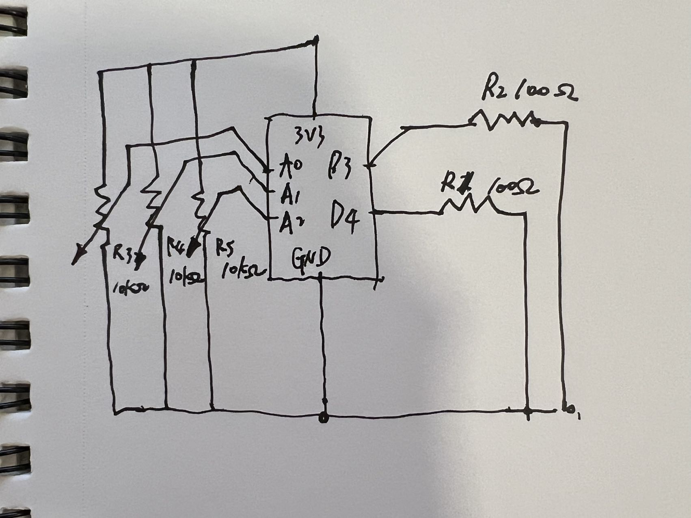

# HW12_PASSWORD

Use 3 analog to input number from potentiometer to create a three digits password machine. I create three states, IDLE, MOVING, STOPPED. Therefore, it enbale the password only check the password when user has rateted the potentiometer, and there is no need for continously real-time checking.

video: 
https://drive.google.com/file/d/1bPKPn4VnIdddKDjzVbY7wnTCrk8THRGz/view?usp=sharing

Circuit Sketch
 
